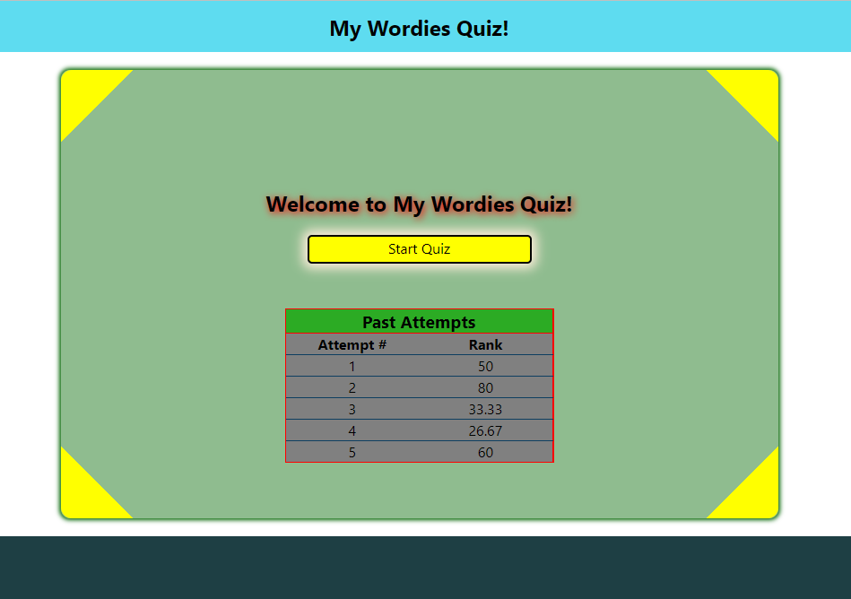
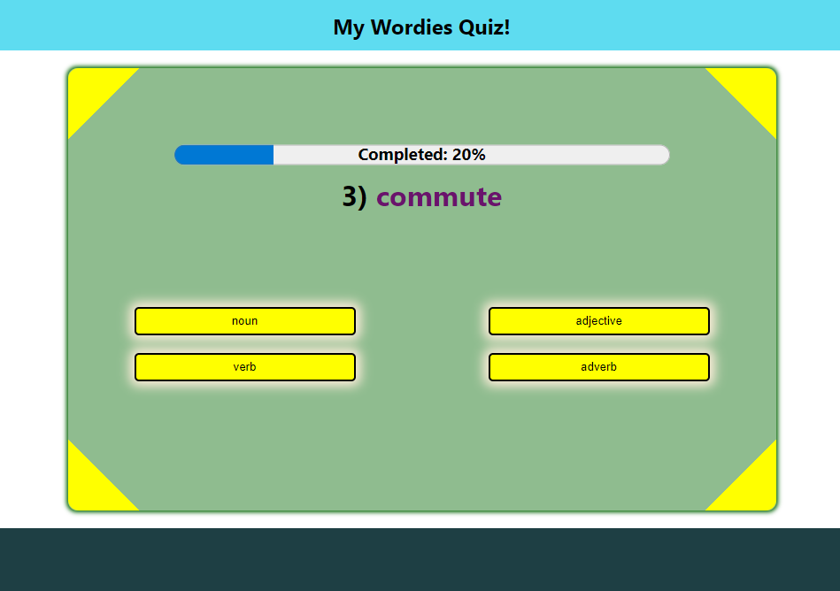

# My Wordies Fullstack Application

In English language, words can be categorized according to their syntactic functions, which is known as "Part of Speech".  
Examples of part of speech: (noun, verb, adjective, ...)

**My Wordies** is an interactive **full-stack** application that helps the students practice categorizing a  
set of words according to their part of speech.

### Built with
Frontend: React, Typescript.
Backend: Node.js, Express, Typescript, Jest.

## Showcase

## Features
### Frontend
- Responsive Design.
- Gives feedback on choosing an option.
- Has a progress bar to show progress.
- Saves the result of previous attempts in local storage, and show them in the main menu.

### Backend
- An endpoint that returns a list of words, randomizing them and ensuring at least 1 word of each type.
- An endpoint that takes a score and returns the corresponding rank.
- Middlewares ensuring proper request for specific endpoints and error handlers.
- Well-structured code for ease of scaling.
- Automatic testing for every aspect of the code.

## Installation & Development

### Prerequisite
You will need to have Node & npm installed.

### Step 1: Clone the repo into your machine. 
Open a command prompt then type `git clone https://github.com/Deadreyo/my-wordies-quiz-app`
### Step 2: Install the frontend & backend.
In a cmd, run `npm install` in app-frontend directory and in app-backend directory.
### Step 3: You're set. Now start the frontend and backend.
To run the frontend, run `npm start`. This will open the app in a new tab.
To run the backend, run `npm run dev`. This will run the server.
Both of these commands will refresh when changes are made.

To test the backend, run `npm run test`.
To build the backend, run `npm run build`, to start the built app, run `npm run start`.

## Usage

To try out the application, make sure to run the backend and the frontend after properly installing both of them.
Frontend: run `npm start` inside app-frontend directory. This will open the app in a new tab.
Backend: run `npm run dev` inside app-backend directory, This will start the server.

Now go to the app and click on Start Quiz.

## Backend API Endpoints

### GET /words
Returns a list of 10 randomized words, containing atleast 1 of each word type.

### POST /ranks
#### Requires: a json with "score" field set to a number.
Returns the rank corresponding to this score.
